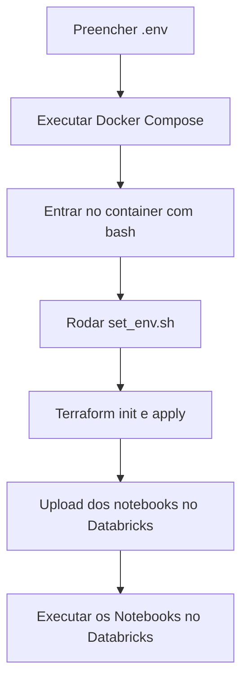

# 🚀 Projeto Adventure Works - Databricks + Terraform + Docker

## 📦 Estrutura do Projeto

- **terraform/**: Scripts Terraform para provisionamento e upload dos notebooks no Databricks.
- **raw_api_extraction.py**: Notebook Python para extração de dados de uma API.
- **raw_mysql_extraction.py**: Notebook Python para extração de dados de um banco MySQL.
- **.env**: Arquivo com variáveis sensíveis (não versionado).
- **Dockerfile / docker-compose.yml**: Containerização para execução padronizada.
- **set_env.sh**: Script que exporta as variáveis do `.env` no formato que o Terraform reconhece.

---

## 🔄 Fluxo do Projeto



---

## ⚙️ Tecnologias Utilizadas

- 🐳 Docker + Docker Compose
- 🏗️ Terraform v1.8
- 🔗 Databricks CLI
- ☁️ Databricks Provider Terraform

---

## 🗂️ Estrutura de Diretórios

```
Adventure-Works/
├── docker-compose.yml
├── Dockerfile
├── terraform/
│   ├── main.tf
│   ├── set_env.sh
│   ├── .env.exemplo
│   └── notebooks/
│       ├── raw_api_extraction.py
│       └── raw_mysql_extraction.py
```

---

## 🔑 Configuração do Ambiente

1. Crie um arquivo `.env` com base no `.env.exemplo`:

```env
DATABRICKS_HOST=https://<seu-workspace>.cloud.databricks.com
DATABRICKS_TOKEN=<seu_token>
USER_EMAIL=<seu_email@databricks.com>
```

---

## 🚀 Como Executar

### 1️⃣ Build do Container

```bash
docker-compose build
```

### 2️⃣ Acessar o Container com Bash

> ⚠️ Importante: use `--entrypoint /bin/bash`, pois o container não possui um processo principal rodando.

```bash
docker-compose run --entrypoint /bin/bash terraform-databricks
```

### 3️⃣ Inicializar o Terraform

```bash
terraform init
```

### 4️⃣ Carregar Variáveis e Aplicar

```bash
bash set_env.sh
terraform apply
```

---

## 🧹 Limpeza (opcional)

Para remover containers órfãos e a rede:

```bash
docker-compose down --remove-orphans
```

---

## 📄 Explicação dos Notebooks

### 🔗 `raw_api_extraction.py`

- Faz requisições HTTP a uma API.
- Processa os dados (JSON → DataFrame).
- Salva no ambiente Databricks no catalog: `ted_dev.<nome_da_tabela>`.

### 🗄️ `raw_mysql_extraction.py`

- Conecta ao MySQL.
- Executa consultas e extrai dados.
- Salva no Databricks no catalog: `ted_dev.<nome_da_tabela>`.

> ✅ Os notebooks `.ipynb` gerados são espelhos da execução dentro do Databricks, para referência local.

---

## 🔐 Gerenciamento de Segredos no Databricks

### ✅ Criação de Secret Scope

```bash
databricks secrets create-scope --scope sqlserver_scope
```

### 🔑 Chaves armazenadas no scope `sqlserver_scope`:

- **Banco de Dados:**
  - `sql_host`
  - `sql_port`
  - `sql_user`
  - `sql_password`

- **API:**
  - `api_user`
  - `api_pass`

### 🔍 Acesso nos notebooks:

```python
dbutils.secrets.get(scope="sqlserver_scope", key="sql_host")
dbutils.secrets.get(scope="sqlserver_scope", key="api_user")
```

---

## ✅ Recursos Provisionados

- Diretório no Databricks: `/Users/<seu_email>/Adventure_Works`
- Notebooks enviados automaticamente:
  - `raw_api_extraction`
  - `raw_mysql_extraction`

> Após provisionar, execute os notebooks diretamente no Databricks.

---

## ⚠️ Observações

- O arquivo `.env` **não deve ser versionado**.
- O uso de Docker garante portabilidade e reprodutibilidade do ambiente.
- A utilização do comando:

```bash
docker-compose run --entrypoint /bin/bash terraform-databricks
```

é **obrigatória**, pois o container não possui um processo ativo por padrão.